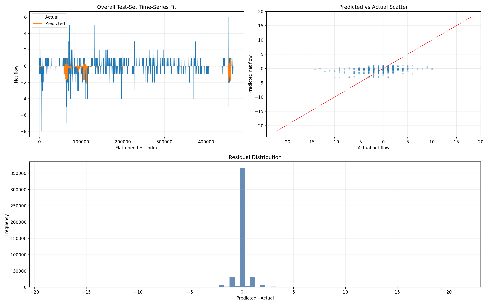
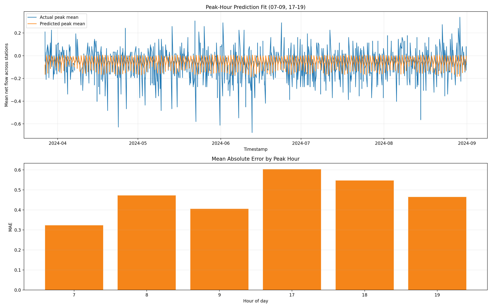
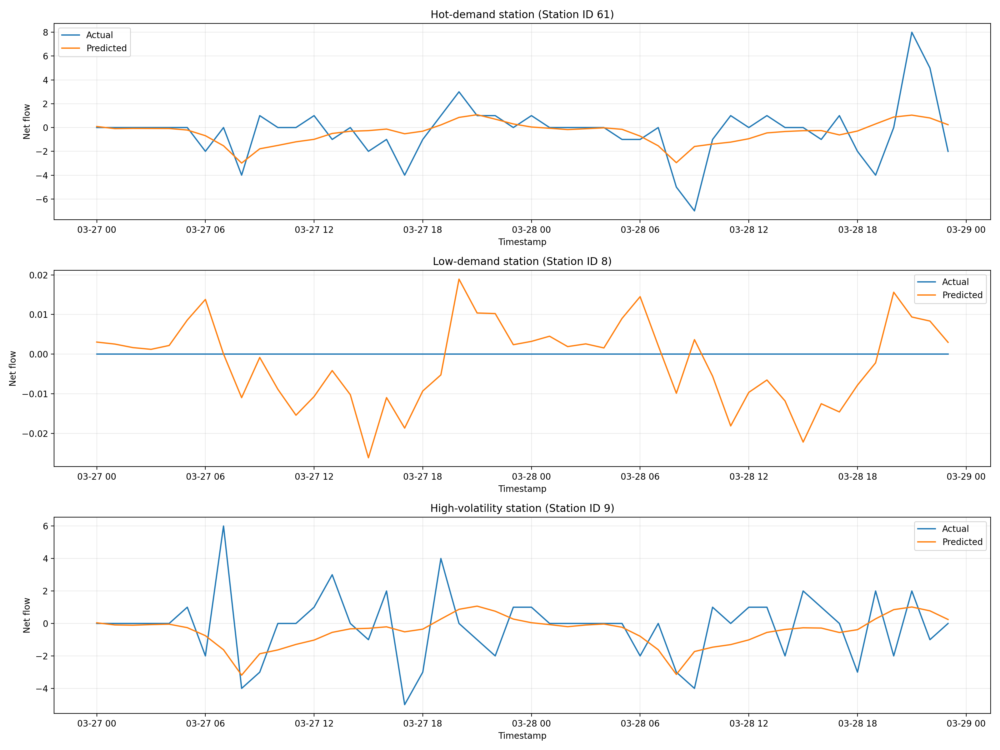
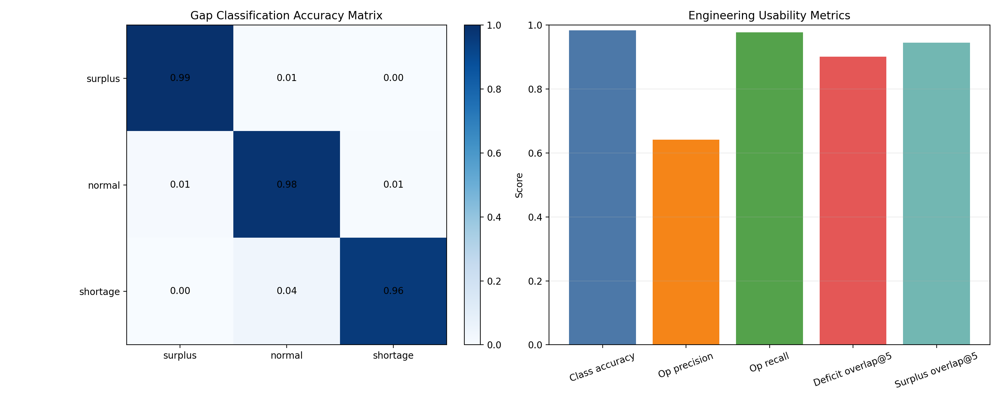

# LSTM?????????????

## 1. ??

???????????????????????????????????????????????????????

- ??????`bike_sharing_lstm_model_optimized.keras`
- ???????`optimized_feature_scaler.pkl`
- ??????`ysu_62_stations_hourly_core_dataset.csv`
- ??????? 48 ????????? 48 ?????

????????????

- ??? `/` ????? `302` ??? `/system/dashboard/`
- ?????? `/system/dashboard/`?`/predict/`?`/predict/results/`?`/predict/spot/`?`/operation/`?`/operation/tasks/`?`/operation/stations/`?`/operation/vehicles/`?`/system/settings/`?`/system/backups/`?`/system/logs/` ??????? `200`

## 2. ????

- ???? LSTM ??? MAE?`0.3675804138`
- ???? LSTM ??? RMSE?`0.8602672815`
- ???? LSTM ??? R??`-0.0095100102`

- ??? LSTM ??? MAE?`0.3150369823`
- ??? LSTM ??? RMSE?`0.8281417489`
- ??? LSTM ??? R??`0.0644799120`

?????

- MAE ???`0.0525434315`
- RMSE ???`0.0321255326`
- R? ???`0.0739899222`

## 3. ?????????

???

- ????????????????????????????????????????????????
- ????????????????????????????????????????????????????
- ???????????????????????????????????????????

## 4. ????????

???

- ??????????????????????????????????????????
- ??????????????????????????????????????????????
- ?????????????????????????????????????????????????

## 5. ????????

??? 3 ??????

- ????????`西北门`
- ????????`新图书馆东侧`
- ????????`东区图书馆`

???

- ???????????????????????????????????
- ??????????????????????????????????????????
- ??????????????????????????????????????????????????????

## 6. ????????

?????

- ??????????`0.9825`
- ??/???????`0.6418`
- ??/????????`0.9766`
- ???? Top5 ????`0.9006`
- ???? Top5 ????`0.9439`

???

- ????????? 4 ???????????????????????????????????????????
- ????????/?????????????????????????????????????
- ??????????????????????????????????????????????????????????????????

## 7. ?????????

- ????????????????? 48?48 ?????LSTM ?????????????????????????? MAE?RMSE?R? ??????????????????? LSTM ???????
- ??????????????????????????????????????????????????????
- ?????????????????????????????????????????????????????????????????

## 8. ????

- ??????????
- ??????????????????????
- ????????????????????????????????
- ????????????????
